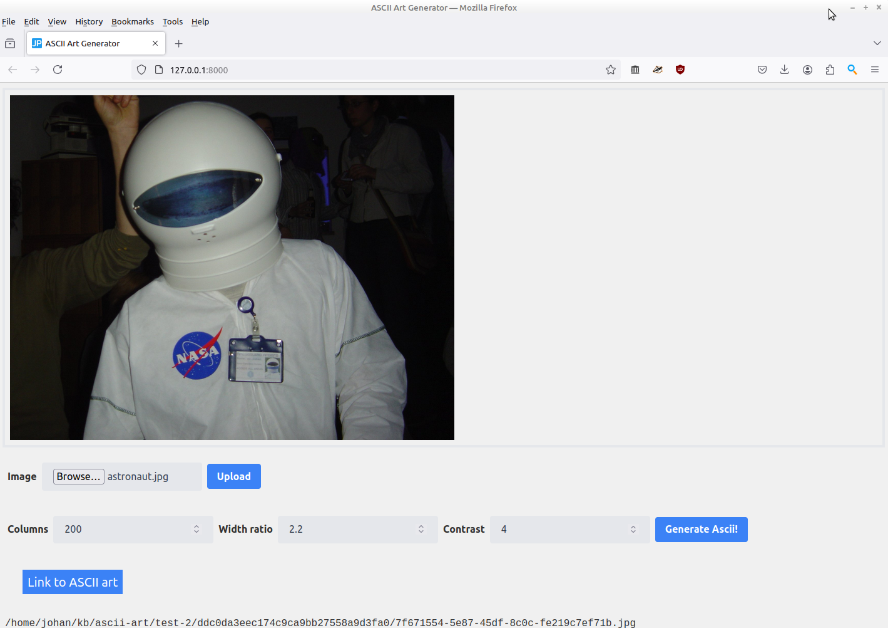
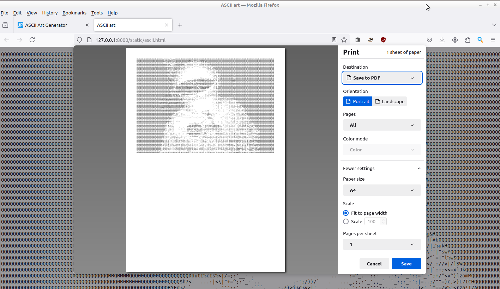

# Image2ascii

Generate printable ASCII art from images in a user-friendly browser interface. 

## Installation

This software was tested with Python 3.8.10. Older versions may not work.

First install the following dependencies:

```
pip install ascii_magic
pip install justpy
pip install lxml
```

Then:

1. Create an empty directory.
2. Download [image2ascii.py](./image2ascii/image2ascii.py) (click "Download raw file" downward arrow button) and save it to this directory.
3. Download [justpy.env](./config/justpy.env) and also save it in this directory.

## Running img2ascii

Open a terminal, command prompt or PowerShell window, and navigate to the directory you created in the previous step. Depending on your OS, start the software with the following command:

```
python3 image2ascii.py
```

or (Windows):

```
python image2ascii.py
```

You should see something like this:

```
/home/johan/.local/lib/python3.8/site-packages/justpy
Module directory: /home/johan/.local/lib/python3.8/site-packages/justpy, Application directory: /home/johan/kb/ascii-art/test-2
JustPy ready to go on http://127.0.0.1:8000
```

Then open the below link in your web browser (preferrably Firefox, see comments below):

<http://127.0.0.1:8000/>

If all goes well, this should open the Image2ascii web interface:


## Upload image

Hit the "Browse" button, and navigate to the image you want to process. Then click the "Upload" button, after which the image is displayed:


## Generate ASCII art

Adjust the "Columns", "Width ratio" and "Contrast" controls to taste. Note that these controls *only* influence the the generated ASCII art (so e.g. changing the "Contrast" value does not affect the image that is shown). Then click the "Generate ASCII" button. At the bottom-left a "Link to ASCII art" button appears:



## View ASCII art

Click the button to open the generate ASCII art (as HTML) in a new browser tab:


## Terminate img2ascii

To stop *img2ascii*, hit `Ctrl-C` from the terminal or command prompt.

## Browser notes

The main goal of this software was to create ASCII art that can be printed at a (more or less) user-defined size. This works quite well in Firefox, using its "Fit to page width" and "Scale" options:



Chromium doesn't appear to support either of these options.

Another thing I noticed, is that Chromium's file browse dialogue always starts at a standard system directory. This means you'll end up clicking through several directory levels to the location where your input images are located, which can get very tedious.

Firefox on the other hands seems to remember the most recently used upload directory, which makes the upload process much smoother.

It's *not* possible to set any defaults for this in the code; this is entirely up to the browser and the oprating system.

Based on these observations, it's probably best to avoid any Chrome-based browsers with this software, and use Firefox instead.

## Licensing

*Image2ascii* is released under the [Apache License, Version 2.0](https://www.apache.org/licenses/LICENSE-2.0).


